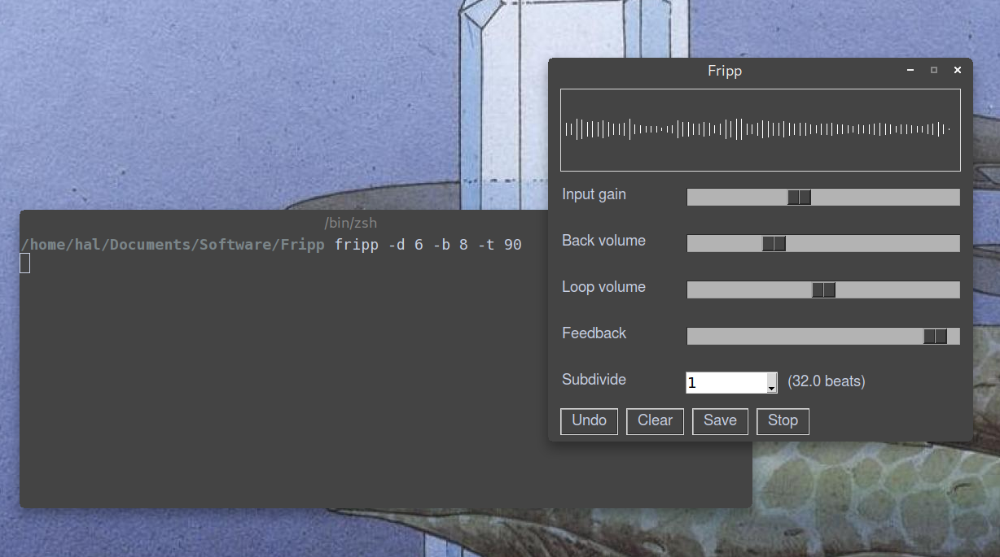

[this used to be cross-platform, but I included Alsa volume control so you can adjust the monitor volume from Fripp, so it's now Linux only. For other platforms, go back to the previous version: https://github.com/Antovigo/Fripp/tree/b0bc546f9a4e44c2b0098d6a028d4973cc8b2c3b]


# Fripp

Named after the musician [Robert Fripp](https://en.wikipedia.org/wiki/Robert_Fripp), who experimented with this kind of things with Brian Eno in pre-computer times, Fripp is a simple audio looper that allows you to build music layer by layer. It is Linux-compatible and does not depend on Jack.

It looks like this:


## Features
* Fripp uses the `sounddevice` library to handle audio, so it should be cross-platform, although I only tested it on Linux.
* AFAIK, it's the only looper that works on Linux and does not depend on Jack. This is the reason why I wrote it, since I didn't want to spend time configuring Jack.
* Adjust the feedback, so the oldest layers slowly decay over time, just like in [Robert Fripp's setup](https://invidious.fdn.fr/watch?v=IVktJ3Ha4AI).
* Record to the entire loop, or to any subdivision of it (for example, if you want the thing you're playing to be repeated on every bar). Any subdivision works, so you can experiment with weird polyrhythms.
* Define the tempo, number of bars and time signature as command-line arguments, or in the config.py file.
* Generate a metronome track, or use a sound file as a backing track (for example, a drum loop) . It will loop over the file and let you record on top of it. Flac files definitely work. Mp3 may or may not work (I haven't tried).
* Save the output to a file.

## Installation

You will need the following python libraries:
- [sounddevice](https://python-sounddevice.readthedocs.io/en/0.4.1/)
- [numpy](https://numpy.org/)
- [pysimplegui](https://pysimplegui.readthedocs.io/en/latest/)
- [soundfile](https://pypi.org/project/SoundFile/)

Then download this repository and run the `fripp.py` script.

```bash
./fripp.py
```

You'll need to find out the number of your sound card. Run this to get a list:

```bash
python -m sounddevice
```
Then set the right number either in the `config.py` file, or with the -d parameter:

```bash
./fripp.py -d 12
```

If the sound is clipped, or you get "underrun" error messages, you should use an external sound card or a USB mic. This is probably required for real-time audio processing, unfortunately.

## Usage
Any parameter, including tempo, loop duration etc. can be specified by editing the `config.py` file. You can also define the default sound card, latency and other stuff there.

### Command-line options

Adjust latency with -l (in ms):

```bash
./fripp.py -l 30
```

You can set loop parameters on the go. Tempo, time signature and number of bars are respectively -t, -s and -b.

```bash
./fripp.py -t 110 -b 8 -s 4
```

This would play a loop of 8 bars in 4/4 at 110 bpm.

To use a sound file as a backing track instead of the metronome, use the -i parameter:

```bash
./fripp.py -i "Backing tracks/funk100bpm.flac"
```

Use the -o parameter to define the filenames that will be used when saving the current loop or the whole output (don't specify an extension, it will be .flac).

```bash
./fripp.py -o darude_sandstorm
```

### Buttons and switches

Input gain is self-explanatory. 

Back volume is the volume of the metronome, or of the backing track sample if you provided one with the -i option. 

Feedback is the ratio of volume decay everytime the loop is played.

Subdivide is the fraction of the whole loop that you are recording to. 
If it's set to 1, the input will be recorded once per loop, as in a regular looper. If it's set to an integer n, it will be recorded n evenly-spaced times across the loop (for example, once per bar). 

Press the spacebar to mute/unmute the input.

The `Undo` button will come back to the last saved of the loop..

The `Clear` button erases the current loop and replaces it with silence.

The `Save` button will write a flac file containing just the current loop. If you save various stages of the loop, you can then assemble them in any audio editor, or use them later as backing tracks with the -i option. If you did not specific a filename with -o, a timestamp will be used instead. A number is added at the end of the filename, so you can save as many loops as you want within a session.

To save the whole output to a soundfile, set the `save_all` option to True in `config.py`. 

You should use headphones to avoid a feedback catastrophe. Keep in mind that I put this together by trial and error until it worked for me, I know nothing about computers and I'm not responsible if it crashes during a gig.

## License
[GPL-3.0](https://choosealicense.com/licenses/gpl-3.0/)
